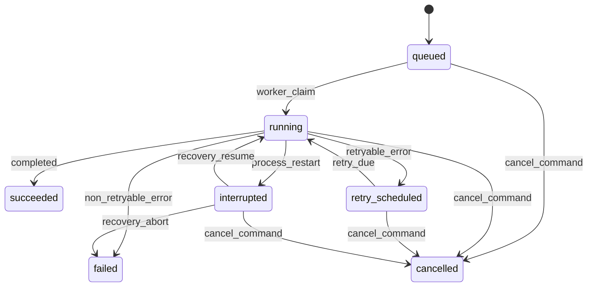
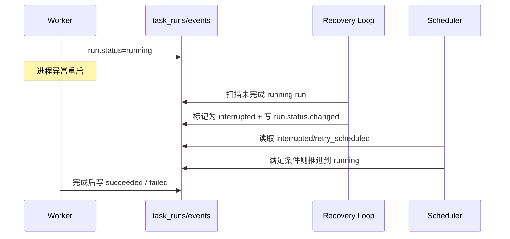

# P3-C 运行可靠性实施基线（P3-C0）

更新时间：2026-02-07  
适用范围：Runtime Owner（`task_runs` 生命周期、失败恢复、重试）

## 1. 运行状态图（Run State Machine）

## 2. 字段契约（`task_runs`）

1. `attempt`
- 语义：同一 `task_id` 的第 N 次运行尝试（从 `1` 开始）。
- 约束：`attempt >= 1`，且 `(task_id, attempt)` 唯一。

2. `idempotency_key`
- 语义：同一运行请求的幂等键。
- 约束：全局唯一、非空（`uq_task_runs_idempotency_key`）。
- 行为：`create_for_task` 遇到已存在 key 返回已有 run，避免重复创建。

3. `next_retry_at`
- 语义：下一次可重试调度时间。
- 约束：仅 `run_status=retry_scheduled` 时允许非空；该状态下必须非空。
- 行为：进入 `running/succeeded/failed/cancelled/interrupted` 时清空。

## 3. 事件写入契约（`run.status.changed`）

每次 run 状态迁移都写入 `events`，payload 固定字段：
1. `run_id`
2. `task_id`
3. `previous_status`
4. `status`
5. `attempt`
6. `idempotency_key`
7. `next_retry_at`
8. `error_code`
9. `actor`

说明：
1. 事件与状态更新在同一事务提交。
2. 事件 `trace_id` 未传入时由后端生成 `trace-run-{run_id}-{uuid}`。

## 4. 恢复时序（进程重启中断场景）

## 5. 失败注入测试桩清单

`app.runtime.failure_injection` 提供 3 类可复用注入模式：
1. `timeout`
2. `transient_error`
3. `process_restart_interrupt`

对应测试：`backend/tests/test_runtime_failure_injection.py`。
