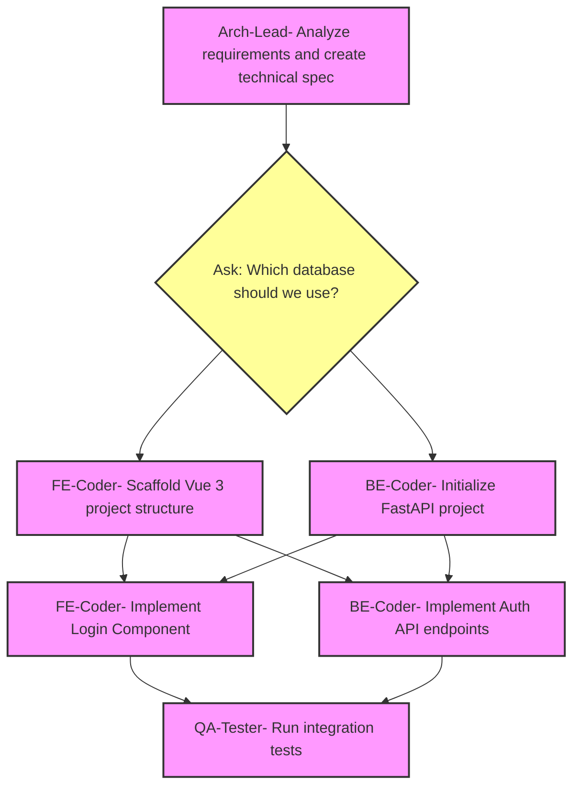

# Plan Execution Graph

```mermaid
graph TD
classDef task fill:#f9f,stroke:#333,stroke-width:2px;
classDef human fill:#ff9,stroke:#333,stroke-width:2px;
cd407fa6-5255-4cf6-a3cd-f2839922ebd7["Arch-Lead- Analyze requirements and create technical spec"]:::task
f373c9df-154d-4a12-9bb8-2edeb0cf6730{"Ask: Which database should we use?"}:::human
c4414c7b-ac21-4163-bb45-f8a02f4b0ce8["FE-Coder- Scaffold Vue 3 project structure"]:::task
0d63a4bf-f708-406e-9fbf-7f067e1a4c56["BE-Coder- Initialize FastAPI project"]:::task
6530760c-c3cf-40c3-92e4-5c3aaa60667f["FE-Coder- Implement Login Component"]:::task
d8cbe128-2179-4ea8-8104-f9fda0eea3f0["BE-Coder- Implement Auth API endpoints"]:::task
d7189c09-08ca-4cb9-830c-970d40c802a7["QA-Tester- Run integration tests"]:::task
cd407fa6-5255-4cf6-a3cd-f2839922ebd7 --> f373c9df-154d-4a12-9bb8-2edeb0cf6730
f373c9df-154d-4a12-9bb8-2edeb0cf6730 --> c4414c7b-ac21-4163-bb45-f8a02f4b0ce8
f373c9df-154d-4a12-9bb8-2edeb0cf6730 --> 0d63a4bf-f708-406e-9fbf-7f067e1a4c56
c4414c7b-ac21-4163-bb45-f8a02f4b0ce8 --> 6530760c-c3cf-40c3-92e4-5c3aaa60667f
c4414c7b-ac21-4163-bb45-f8a02f4b0ce8 --> d8cbe128-2179-4ea8-8104-f9fda0eea3f0
0d63a4bf-f708-406e-9fbf-7f067e1a4c56 --> 6530760c-c3cf-40c3-92e4-5c3aaa60667f
0d63a4bf-f708-406e-9fbf-7f067e1a4c56 --> d8cbe128-2179-4ea8-8104-f9fda0eea3f0
6530760c-c3cf-40c3-92e4-5c3aaa60667f --> d7189c09-08ca-4cb9-830c-970d40c802a7
d8cbe128-2179-4ea8-8104-f9fda0eea3f0 --> d7189c09-08ca-4cb9-830c-970d40c802a7
```
